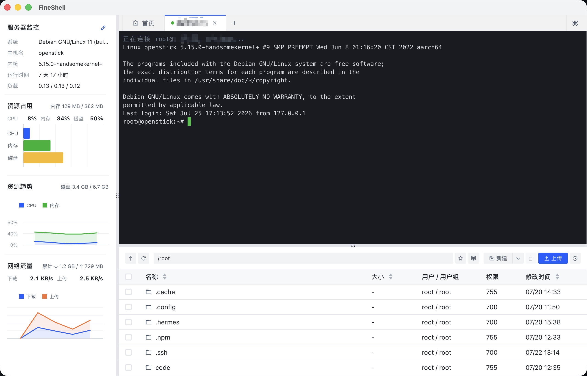
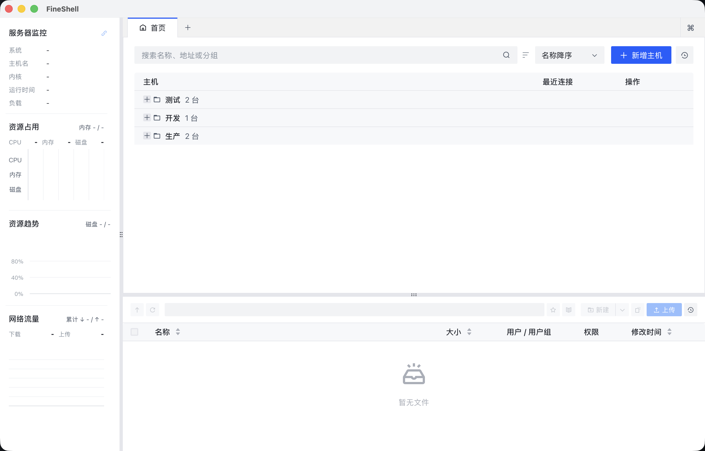
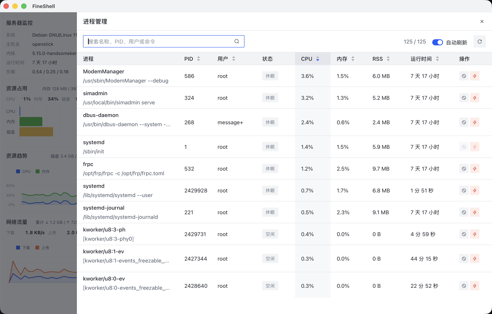
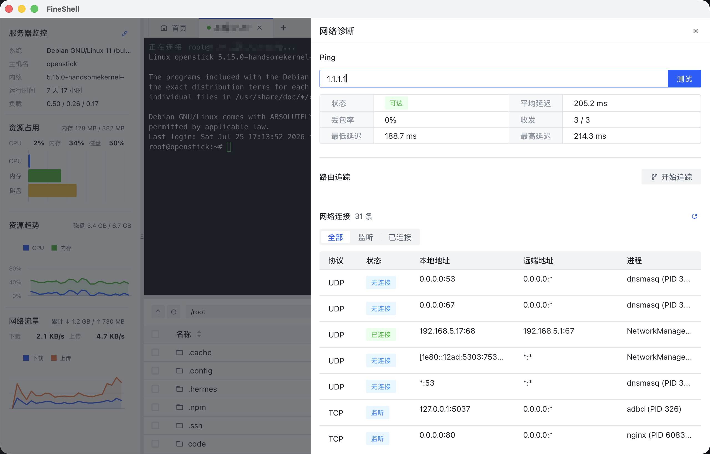
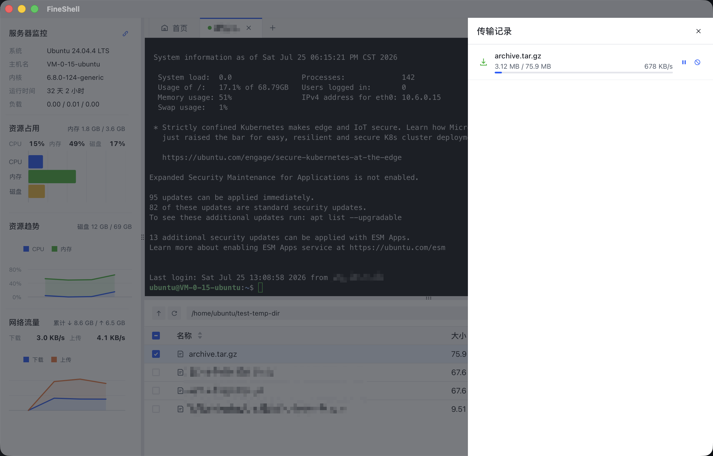
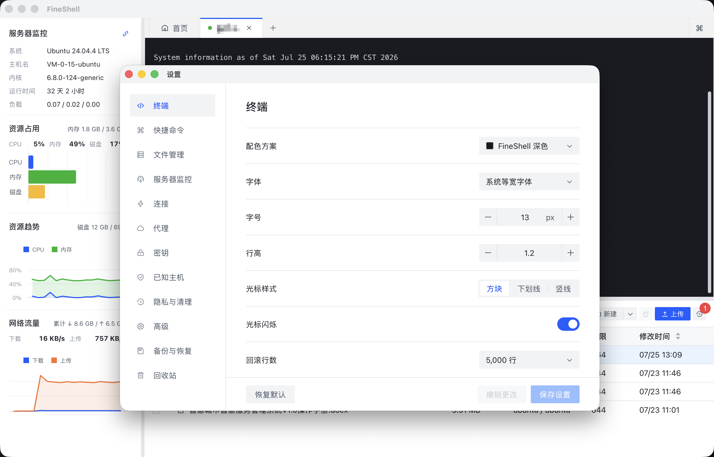
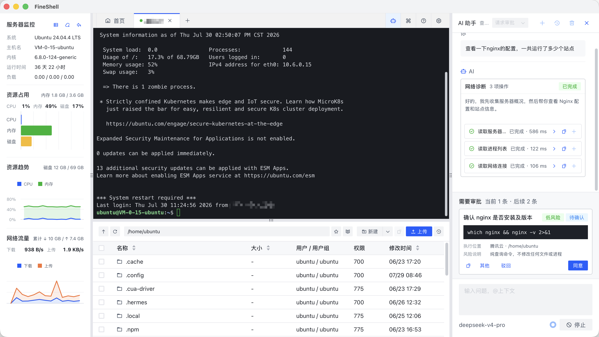

# FineShell

<p align="center">
  
</p>

<p align="center">
  一个面向开发者和轻量运维场景的跨平台 SSH 工作台，将终端、SFTP 文件管理和服务器监控集中在同一个桌面窗口中。
</p>

<p align="center">
  <a href="https://github.com/Max0897/fineshell/actions/workflows/ci.yml"></a>
  <a href="https://github.com/Max0897/fineshell/releases"></a>
  
  
  
  <a href="LICENSE"></a>
</p>



## 核心能力

| 模块     | 已实现能力                                                   |
| ------ | ------------------------------------------------------- |
| 主机管理   | 分组与树形列表、搜索排序、连接历史、复制与回收站、配置导入导出                         |
| SSH 连接 | 密码、私钥、托管密钥和 SSH Agent 认证，SOCKS5 / HTTP CONNECT 代理，一级跳板机 |
| 连接可靠性  | SHA256 主机指纹确认、保活、自动重连、连接取消、结构化错误提示                      |
| 终端     | 多主机多会话标签、内容搜索、快捷命令、动态参数、本地 / 远程 / 动态 SOCKS5 端口转发        |
| AI 助手  | OpenAI 兼容服务、上下文提及、流式对话、服务器诊断、终端命令与远程文件操作、分级审批和执行结果验证       |
| SFTP   | 上传下载、暂停继续、取消重试、批量拖拽、复制移动、排序、权限及用户/用户组管理                 |
| 文件编辑   | 内置文本编辑、调用本地默认或指定编辑器、文件变化自动同步远端、冲突处理                     |
| 归档操作   | 远程压缩与解压、目录及多选项目打包下载，支持 `.tar.gz`、`.tar` 和 `.zip`        |
| 服务器监控  | 系统信息、CPU / 内存 / 磁盘占用与趋势、网络流量、进程管理和网络诊断                  |
| 应用设置   | 终端、文件管理、监控、连接、代理、密钥、已知主机、隐私清理及备份恢复设置                    |

## 界面预览

### 主机首页

通过分组树形表格集中管理主机，支持搜索、排序、新增主机和连接历史；



### 进程管理

查看远程进程的 CPU、内存、用户与运行时间，支持搜索、排序、自动刷新和发送结束信号。



### 网络诊断

通过当前 SSH 会话执行 Ping、路由追踪，并查看远程端口监听和网络连接状态，无需安装额外 Agent。



### 传输记录

集中查看文件上传、下载与同步任务的进度、速度和状态，并可暂停或取消正在执行的任务。



### 设置

在独立设置窗口中统一调整终端、快捷命令、AI 服务、文件管理、服务器监控、连接、代理、密钥和备份恢复选项。



### AI 运维助手

FineShell 将 AI 助手放在当前 SSH 工作区右侧。它可以结合服务器状态、终端输出和远程文件理解问题，通过受控工具完成信息采集，并在执行终端命令或修改文件前按照当前审批模式处理授权。



#### 主要能力

- 支持 OpenAI、DeepSeek、Ollama，以及其他兼容 OpenAI 接口的自定义服务。
- 支持获取模型列表，并检测基础对话、流式输出和工具调用能力。
- 可以通过 `@` 提及终端选区、最近终端输出、服务器状态、当前远程目录和远程文件；发送前会隐藏检测到的密钥、令牌等敏感内容。
- 提供服务器状态、进程、当前目录、网络连接、Ping 和路由追踪等诊断工具，工具权限可在设置中单独启停。
- 可以生成结构化终端命令，展示用途、执行位置和风险说明，并在执行后采集退出码与结果供 AI 继续分析。
- 可以提出远程文件修改、新建、重命名和删除操作，支持差异审阅、冲突检查、批量应用及安全回滚。
- 支持流式对话、对话历史、长对话自动摘要、任务中断以及 SSH 断线后的受控恢复。

#### Agent 工作流程

1. AI 根据问题和显式添加的上下文拆解任务。
2. 通过已授权的只读工具采集服务器证据，并持续更新执行状态。
3. 需要执行命令或变更文件时，在输入框上方展示审批卡片。
4. 用户可以选择同意、拒绝或补充说明；通过审批后，FineShell 才会在当前连接中执行操作。
5. 后端记录命令退出状态、文件校验和业务验证结果，再由 AI 根据真实结果继续处理或给出结论。

#### 审批模式

| 模式 | 行为 | 适用场景 |
| --- | --- | --- |
| 请求审批 | 受控操作由用户逐项确认 | 初次使用、生产环境和关键主机 |
| 替我审批 | 自动执行经过策略判断的安全操作，风险操作仍需确认 | 日常诊断和重复性维护 |
| 完全访问 | 在当前主机和连接周期内自动执行策略允许的受控操作，超出安全边界的操作仍会被阻止或要求确认 | 明确范围内的连续自动化任务 |

#### 开始使用

1. 打开“设置 → AI 助手”，选择服务并填写服务地址、模型和 API Key；API Key 会保存到操作系统凭据库，本地 Ollama 服务可以不填写。
2. 使用“检测能力”确认当前模型是否支持对话、流式输出和工具调用。
3. 连接主机后，点击主窗口右上角的 AI 图标打开侧栏，并选择本次连接使用的审批模式。
4. 直接输入问题，或者使用 `@` 添加需要分析的终端、服务器和远程文件上下文。

## 下载与安装

前往 [GitHub Releases](https://github.com/Max0897/fineshell/releases) 下载对应平台的安装包：

- macOS：Apple Silicon / Intel `.dmg`
- Linux：x64 / ARM64 `.deb`
- Windows：x64 `.exe`（NSIS）/ `.msi`，ARM64 `.exe`（NSIS）

### Linux

请使用 APT 安装 `.deb`，APT 会同时安装 FineShell 所需的 WebKitGTK 等系统依赖：

```bash
sudo apt update
sudo apt install ./FineShell_0.1.12_linux_arm64.deb
```

请根据实际下载的文件名调整命令。不要直接使用 `dpkg -i`，因为 `dpkg` 不会自动下载缺失的依赖。

如果已经使用 `dpkg -i` 导致软件包处于未配置状态，可执行：

```bash
sudo apt --fix-broken install
```

## 从源码运行

### 环境要求

- [Rust stable](https://www.rust-lang.org/tools/install)
- [Bun](https://bun.sh/docs/installation)，CI 当前使用 `1.3.11`
- 对应操作系统的 [Tauri 2 开发依赖](https://v2.tauri.app/start/prerequisites/)

### 启动开发环境

```bash
git clone https://github.com/Max0897/fineshell.git
cd fineshell
bun install --frozen-lockfile
bun run tauri dev
```

### 构建安装包

```bash
bun run tauri build
```

## 开发与测试

```bash
# 前端单元测试、类型检查和生产构建
bun run check

# Rust 单元测试
cargo test --manifest-path src-tauri/Cargo.toml --locked

# Rust 静态检查
cargo clippy --manifest-path src-tauri/Cargo.toml \
  --all-targets --all-features --locked -- -D warnings
```

需要真实服务器的集成测试默认标记为 `ignored`，仅在明确提供 `FINESHELL_LIVE_*` 环境变量时运行。测试可能在远端 `/tmp` 创建临时目录，结束后会自动清理。

<details>
<summary>运行 SFTP 在线测试</summary>

```bash
FINESHELL_LIVE_HOST_ID=<已保存主机 ID> \
FINESHELL_LIVE_ADDRESS=<主机地址> \
FINESHELL_LIVE_PORT=<SSH 端口> \
FINESHELL_LIVE_USERNAME=<用户名> \
cargo test --manifest-path src-tauri/Cargo.toml --lib \
  sftp::tests::completes_a_live_sftp_round_trip -- --ignored --exact
```

</details>

## 技术栈

| 层级    | 技术                                   |
| ----- | ------------------------------------ |
| 桌面运行时 | Tauri 2                              |
| 前端    | React 18、TypeScript、Vite、Arco Design |
| 终端    | xterm.js                             |
| 图表    | VChart                               |
| 后端    | Rust、ssh2、Tokio                      |
| 凭据存储  | keyring / 操作系统凭据库                    |
| 工具链   | Bun、Cargo、GitHub Actions             |

前端通过版本化的 Tauri 命令与事件协议调用 Rust 后端。SSH、SFTP、文件传输和系统监控都在后端执行，前端只接收展示所需的数据与状态事件。

## 贡献

欢迎提交 Issue 和 Pull Request。开始较大改动前，建议先通过 Issue 对齐范围。

- `main` 只接收已经通过 CI 的合并结果，不直接在该分支开发。
- 提交 Pull Request 前请运行 `bun run check`、Rust 测试和 Clippy。
- 一个 Pull Request 尽量只解决一个清晰问题，并同步补充对应测试或文档。

## 版本发布

开发过程中将变更记录到 `CHANGELOG.md` 顶部的 `Unreleased` 区域。发布时在 GitHub Actions 中运行 `Prepare Release` 并选择版本级别，工作流会统一升级版本、整理更新日志并创建发布 PR。合并发布 PR 后会自动构建 macOS、Linux 和 Windows 安装包，并发布签名后的 OTA 更新清单。

GitHub 仓库需要配置 Tauri 更新签名私钥 `TAURI_SIGNING_PRIVATE_KEY`。完整架构与失败重试方式见 [发布流水线文档](docs/release-pipeline.md)。

## 支持项目

如果 FineShell 对你有帮助，可以通过反馈问题、完善文档、贡献代码、分享项目或自愿打赏来支持它。打赏不会影响功能开放、Issue 处理或贡献者权益。

<p align="center">
  
</p>

## 开源许可

FineShell 使用 [Apache License 2.0](LICENSE) 开源。你可以自由使用、修改和分发本项目，但需要保留许可证及相关版权声明。
